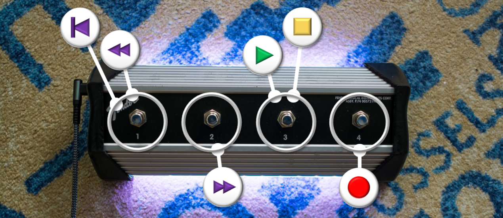

# Logic Pro Transport Controller

[Logic Pro](https://www.apple.com/logic-pro/) is a professional music recording and production software for Mac that essentially brings an entire music recording studio to your laptop. It's perhaps a bit deceiving given how accessible the software is, but Logic Pro is so professional that a number of big-time musicians have used it to produce albums, including Ed Sheeran (Shape of You), Billie Eilish (most of her music), Taylor Swift (Speak), and The Strokes (Is This It). The DAW (digital audio workstation) is consistently ranked as one of the best available, and was again [rated highly for 2024](https://www.musicradar.com/news/the-best-daws-the-best-music-production-software-for-pc-and-mac).

Likely the most frequently used commands in Logic Pro (at least on the recording side) are contained in a part of the DAW known as the _transport controls_. Below is a snapshot of the transport buttons:

<p align="center">
  
</p>

Here's where you'll find options for _return to the beginning_, _rewind_, _fast forward_, _stop_, _play_, and _record_ - in other words, the essential commands for navigating the track. These commands are used so frequently used that you can buy a separate device that facilitates transport control, or a _transport controller_. There are some really interesting controllers on the market, like [this one](https://www.presonus.com/en-US/controllers/control-surface/faderport-series/2777100203.html) from PreSonus. However, these transport controllers are typically rather expensive (anywhere from \$200 to \$500 or more) and aren't customizable. They also tend to be overkill if you're only using a few buttons, plus they require an extra free hand to use.

This is where this project was born. The Logic Pro transport controller designed and built here is entirely customizable, is intended to be operated as a footswitch (so your hands are free to play the music), is a simple plug-and-play (no drivers required), and adds an element of feedback in the form of LEDs. It's certainly more function over form, but its vintage Fender footswitch body and underbody LEDs also make for a cool addition to the recording studio. Happy recording.

## 1. :notes: Project Description
The Logic Pro transport controller detailed here is a simple addition to a vintage 4-button Fender footswitch intended for the Mustang series of guitar amplifiers. I added a microcontroller (Arduino Micro), cast LED strip lights in epoxy underneath the footswitch, and designed and 3D-printed new custom end caps to make room for the additional wiring and new connection (changed to USB-C from MIDI). Further details can be found below.

## 2. :mag: Table of Contents

[Logic Pro Transport Controller](#logic-pro-transport-controller)
- [Logic Pro Transport Controller](#logic-pro-transport-controller)
  - [1. :notes: Project Description](#1-notes-project-description)
  - [2. :mag: Table of Contents](#2-mag-table-of-contents)
  - [3. :beginner: Usage](#3-beginner-usage)
    - [3.1 :1234: Startup sequence](#31-1234-startup-sequence)
    - [3.2 :rewind: Rewind](#32-rewind-rewind)
    - [3.3 :fast_forward: Fastforward](#33-fast_forward-fastforward)
    - [3.4 :end: Back to beginning](#34-end-back-to-beginning)
    - [3.5 :arrow_forward: Play](#35-arrow_forward-play)
    - [3.6 :red_circle: Record](#36-red_circle-record)
    - [3.7 :triangular_flag_on_post: Stop](#37-triangular_flag_on_post-stop)
  - [4. :wrench: Development](#4-wrench-development)
    - [4.1 :clipboard: Development Environment](#41-clipboard-development-environment)
    - [4.2 :construction: File Structure](#42-construction-file-structure)
    - [4.3 :hammer: Build](#43-hammer-build)
    - [4.4 :runner: Deployment](#44-runner-deployment)
  - [5. :pencil: Bill of Materials](#5-pencil-bill-of-materials)
  - [6. :battery: Circuit Diagram / Schematic](#6-battery-circuit-diagram--schematic)
  - [7. :computer: CAD Drawings / 3D Models](#7-computer-cad-drawings--3d-models)
  - [8. :notebook: Notes](#8-notebook-notes)
  - [9. :camera: Gallery](#9-camera-gallery)
  - [10. :books: Credit / Acknowledgment](#10-books-credit--acknowledgment)
  - [11. :e-mail: Contact](#11-e-mail-contact)
  - [12. :scroll: License](#12-scroll-license)

## 3. :beginner: Usage
Configuration for this project is done exclusively in [Cfg_Types.h](include/Cfg_Types.h), where you can configure the following:
- Type of LED
- Number of LEDs
- Brightness
- Connections (switches and LEDs)
- LED color order
- Colors used (ex. init, rewind, fast forward, record, etc.)
- Frequency of the fade in the Play and Stop states
- Turn on / off keyboard emulation (for debugging)
- Commands sent by each switch on the footswitch

While everything here can be configured and adjusted, the default setup is shown below.

**Type of LED:** `WS2811`
**Number of LEDs:** `58`
**Brightness:** `128`
**LED color order:** `GRB`
**Colors used:** `init = white`, `rewind = indigo`, `start = indigo`, `fastfoward = indigo`, `play = green`, `stop = yellow / orange`, `record = red`
**Fade frequency**: `1 Hz`

The instructions below explain how to use the footswitch to control Logic Pro.

<p align="center">
  
</p>

### 3.1 :1234: Startup sequence
When the transport controller is first connected to power, it will go through an LED sequence to indicate initialization. This is currently configured for a few LED pulses followed by a gradual fade to brightness, but this is fully configurable.

<p align="center">
  
</p>

### 3.2 :rewind: Rewind
The first button moves the playhead back one measure. This will be momentarily acknowledged by one fade cycle of the LEDs.

### 3.3 :fast_forward: Fastforward
The second button moves the playhead forward one measure. This will be momentarily acknowledged by one fade cycle of the LEDs.

<p align="center">
  
</p>

### 3.4 :end: Back to beginning
Holding the first button moves the playhead back to the beginning of the track. This will be momentarily acknowledged by one fade cycle of the LEDs.

<p align="center">
  
</p>

### 3.5 :arrow_forward: Play
The third button toggles between play / stop. If the track is currently in the stopped state, pressing the third button will cause the track to play. This will be reflected via a cyclical fading green pattern in the LEDs, which continues as long as the track is still playing.

<p align="center">
  
</p>

### 3.6 :red_circle: Record
The fourth button starts the track recording. If the track is currently in the stopped state, pressing the fourth button will cause the track to play and start recording. If the track is already playing, this will turn on the recording. Recording will be reflected via a cyclical fading red pattern in the LEDs, which continues as long as the track is still recording.

<p align="center">
  
</p>

### 3.7 :triangular_flag_on_post: Stop
The third button is used to stop the track when in either the playing or recording state. The stopped state will be acknowledged by yellow / orange LEDs.

## 4. :wrench: Development
The sections below discuss the setup of the project, necessary installations, and how to build and flash the project.

### 4.1 :clipboard: Development Environment
The documentation for this project assumes a setup that includes **Visual Studio Code** and the **PlatformIO extension**. PlatformIO is actually a standalone, cross-platform, open-source system that provides unified debugging, unit testing, static code analysis, and other features, but this project used PlatformIO in the context of a VS Code extension.

### 4.2 :construction: File Structure
Below is an illustration of the file structure used in this project.

```
.
├── cad
│   ├── LeftEndCover.FCStd
│   ├── LeftEndCover.stl
│   ├── RightEndCover.FCStd
│   ├── RightEndCover.stl
├── doc
│   ├── architecture
│   │   └── SystemElectricalSchematic.kicad_sch
│   ├── design
│   │   ├── module
│   │   │   ├── Footswitch.md
│   │   │   ├── LEDController.md
│   │   │   ├── Micro.md
│   │   │   ├── Module.md
│   │   │   ├── SerialCommunication.md
│   │   │   └── Switch.md
│   │   ├── system
│   │   │   ├── SequenceDiagram.md
│   │   └── └── StateDiagram.md
│   └── requirements
│       └── Requirements.md
├── include
│   ├── Cfg_Types.h
│   ├── Footswitch.h
│   ├── LEDController.h
│   ├── Micro.h
│   ├── SerialCommunication.h
│   └── Switch.h
├── src
│   ├── Footswitch.cpp
│   ├── LEDController.cpp
│   ├── main.cpp
│   ├── Micro.cpp
│   ├── SerialCommunication.cpp
│   └── Switch.cpp
├── test
│   └── test_main.cpp
├── platformio.ini
└── README.md
```

| No | Directory                | File                                  | Details
|----|--------------------------|---------------------------------------|---------------------------------------------------------------
| 1  | cad                      | /*.FCStd                              | FreeCAD files
| 2  | cad                      | /*.stl                                | Stereolithography files for 3D printing (sliced with Cura or similar)
| 3  | doc/architecture         | /SystemElectricalSchematic.kicad_sch  | Electrical schematic for the project
| 4  | doc/design/module        | /*.md                                 | Detailed design documents for each module
| 5  | doc/design/module        | /Module.md                            | Class diagram
| 6  | doc/design/system        | /SequenceDiagram.md                   | Sequence diagram
| 7  | doc/design/system        | /StateDiagram.md                      | State diagram
| 8  | doc/design/requirements  | /Requirements.md                      | Functional and non-functional requirements for the project
| 9  | include                  | /*.h                                  | Class declaration
| 10 | include                  | /Cfg_Types.h                          | Configuration file, all configuration is done here
| 11 | src                      | /*.cpp                                | Class definition
| 12 | src                      | /main.cpp                             | Main program
| 13 | test                     | /test_main.cpp                        | Main test file, only dummy tests at the moment
| 14 | .                        | /platformio.ini                       | PlatformIO Project Configuration File

### 4.3 :hammer: Build
1. **Clone the Repository**
First, clone the repository to your local machine. You can do this with the following command: `git clone https://github.com/c-coyne/logic-pro-transport-controller.git`
2. **Install PlatformIO**
To build the project, you'll need PlatformIO installed on your system. I used the PlatformIO extension in Visual Studio Code, which includes both the [PlatformIO IDE for VSCode](https://docs.platformio.org/en/latest/integration/ide/vscode.html#ide-vscode) as well as the [PlatformIO Core (CLI)](https://docs.platformio.org/en/latest/core/index.html#piocore), which can be used within the PlatformIO IDE terminal. If you need help installing the PlatformIO extension, check [here](https://docs.platformio.org/en/latest/integration/ide/vscode.html#installation).
3. **Open the Project**
Launch PlatformIO, then open the cloned project folder by choosing _Open Project_ and selecting the project directory.
4. **Resolve Dependencies**
Before you can build the project, you must ensure that all required libraries are installed. These include the **FastLED v3.6.0** (fastled/FastLED@^3.6.0) and **Arduino Keyboard v1.0.5** (arduino-libraries/Keyboard@^1.0.5) libraries, which should both be listed in the _platformio.ini_ file in the main project directory.
5. **Build the Project**
After opening the project, you can build it using the _Build_ button in the PlatformIO window (micro/General/Build) or via the _PlatformIO: Build_ button at the bottom of the screen.

### 4.4 :runner: Deployment
1. **Connect Your Device**
Connect the hardware device (in this case, the Arduino Micro) to your computer via USB.
2. **Check the Connection**
If the device is connected properly, you can see it in the _Quick Access_ window under _Devices_. You can also open a PlatformIO terminal and run `pio device list`. If the device is connected and detected, it will be listed in the output of this command. More information can be found in the [PlatformIO documentation](https://docs.platformio.org/en/stable/core/userguide/device/cmd_list.html).
3. **Set the Upload Port**
PlatformIO should detect the device port by default, so no specification should be needed. However, if you'd like to specify a specific COM port, you can do so in the platform.ini file with the option 
```
upload_port = COM7 ; replace with your port
```
4. **Upload to Your Device**
Upload the project code onto your device using the _Upload_ button in the PlatformIO window (micro/General/Upload) or via the _PlatformIO: Upload_ button at the bottom of the screen.
5. **Monitor the Output**
If needed, use the Serial Monitor to monitor the output from the device in the event of any required debugging.

## 5. :pencil: Bill of Materials

The bill of materials is listed below. Note that I've listed the prices as if each component was purchased new, but the majority of these items I purchased used.

| No | Quantity | Item                                                                                  | Cost    | Description
|----|----------|---------------------------------------------------------------------------------------|---------|----------------------------------------------------------------
| 1  | 1x       | [Arduino Micro](https://store-usa.arduino.cc/products/arduino-micro?selectedStore=us) | \$24.90 | Arduino Micro microcontroller board based on the ATmega32U4, selected for its ability to use the Keyboard library
| 2  | 1x       | [Fender Footswitch](https://www.fender.com/en-US/parts/footswitches/4-button-footswitch-mustang-series-amplifiers/0080996000.html)                                                                                                   | \$89.99 | Four button footswitch designed to be used with the Fender Mustang series of guitar amplifiers
| 3  | 1x       | [LED Strip Lights](https://www.amazon.com/gp/product/B0BNN34NCG/ref=ppx_yo_dt_b_search_asin_title?ie=UTF8&th=1)                                                                                                   | \$8.99 | 5V WS2812B 3.3ft LED strip lights
| 4  | 1x       | [Panel Mount USB Type C 3.1 Adapter](https://www.amazon.com/dp/B09HWSFRP1?ref=ppx_yo2ov_dt_b_product_details&th=1) | \$7.50 | 1ft panel mount USB Type C adapter
| 5  | 1x       | [USB C to Micro USB Adapter](https://www.amazon.com/gp/product/B07VBV1PY5/ref=ppx_yo_dt_b_search_asin_title?ie=UTF8&psc=1) | \$6.99 | Adapter to convert from USB C (external connection) to Micro USB (Arduino Micro connection)
| 6  | 1x       | [USB C Cable](https://www.amazon.com/gp/product/B094YDZQ1C/ref=ppx_yo_dt_b_search_asin_title?ie=UTF8&psc=1) | \$9.99 | Cable to connect the footswitch to the laptop
| 7  | 1x       | [Epoxy](https://www.amazon.com/gp/product/B07S1MLQMJ/ref=ppx_yo_dt_b_search_asin_title?ie=UTF8&psc=1) | \$13.99 | Epoxy for casting the underbody LEDs
| 8  | 1x       | Jumper wires | - | -
| 9  | 1x       | Prototyping breadboard (if desired) | - | - 


## 6. :battery: Circuit Diagram / Schematic
The circuit for this project is very simple, and most of the circuit is already provided by the production Fender footswitch. The footswitch uses a 5-pin DIN connector for MIDI connection, where each pushbutton switch on the footswitch pulls the respective line to ground. The circuit board inside the footswitch makes each of the DPDT switch terminals easily accessible, which facilitated additional solder connections to the Arduino Micro. Therefore, assembling the electrical aspects of the project was straightforward, but feel free to check out the [schematic](doc/architecture/SystemElectricalSchematic.kicad_sch) for more details.

## 7. :computer: CAD Drawings / 3D Models
The STL files used in this project are available in the _cad_ directory. These files fit the vintage model of the Fender 4-button footswitch and were specifically designed to accommodate the thickness of my resulting epoxy pad underneath the footswitch. If you want to build this project and your epoxy pad isn't ~0.3", you'll need to adjust the design slightly.

I've included both the STL files (to facilitate 3D printing) as well as the FreeCAD files for modification of the design. Note that the left end cover was born out of the right end cover, so the final step should be mirroring the main body about the XZ plane.

## 8. :notebook: Notes
There really is no limit to how this project might be extended, and below are a few ideas if time permitted:
- more functionality in the underbody LEDs (Disco mode? Lava lamp simulation?)
- more functionality in the switches (double-click, hold, two switches at once, etc.)
- an underlying menu with the ability to switch "modes" and have access to even more features
- a built-in potentiometer to adjust the LED brightness in real time instead of being defined as a macro
- a GUI for configuration

## 9. :camera: Gallery

<p float="left">
    
    
</p>
<p float="left">
    
    
</p>
<p float="left">
    
    
</p>
<p float="left">
    
    
</p>
<p float="left">
    
    
    
</p>

## 10. :books: Credit / Acknowledgment

**FastLED**: This project uses the [FastLED 3.6.0 library](https://github.com/FastLED/FastLED), which was created to very easily and efficiently control a range of LED types. While this Logic Pro Transport Controller project only uses the library to control WS2811 LEDs, the FastLED library supports a wide variety of LED chipsets, including Neopixel (WS2812B), WS2801, APA102, and many more. FastLED is available through the PlatformIO Library Manager, but you can also check it out [here](https://github.com/FastLED/FastLED).

**Keyboard**: One of the primary features of this project is the ability to send commands to the connected laptop to simulate a keyboard, and the Arduino Keyboard library was used for this purpose. Like the FastLED library, the Arduino Keyboard library is available through the PlatformIO Library Manager.

## 11. :e-mail: Contact

Christopher Coyne: christopher.w.coyne@gmail.com  
Project Link: https://github.com/c-coyne/logic-pro-transport-controller

## 12. :scroll: License
This project is licensed under the [MIT License](https://opensource.org/license/MIT).