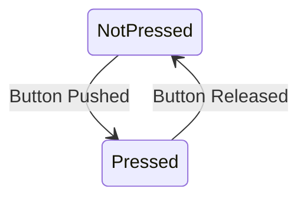

# Switch Class

## Class Description
The `Switch` class represents a physical pushbutton switch. It has two possible states: pressed and not pressed. The default state is "not pressed".

## Attributes
- `state`: A boolean attribute representing the state of the switch. `true` indicates the switch is pressed, while `false` indicates it is not pressed.

## Methods

### `Switch()`
- **Description**: This is the constructor for the `Switch` class. It initializes a new instance of a `Switch`, setting the `state` to `false` (not pressed).
- **Input Parameters**: None.
- **Return Type**: Does not return a value.

### `~Switch()`
- **Description**: This is the destructor for the `Switch` class. It cleans up the instance of the `Switch` when it is no longer needed.
- **Input Parameters**: None.
- **Return Type**: Does not return a value.

### `bool getState()`
- **Description**: This method returns the current state of the `Switch`.
- **Input Parameters**: None.
- **Return Type**: Returns a boolean indicating the current state of the `Switch`. Returns `true` if the switch is pressed and `false` if it is not pressed.

## Dependencies
This class does not have any dependencies on other classes.

## State diagram


## Examples
```
// create a new switch object
Switch mySwitch;

// check the state of the switch
bool currentState = mySwitch.getState();
if (currentState) {
  // code here runs if the switch is pressed
} else {
  // code here runs if the switch is not pressed
}
```