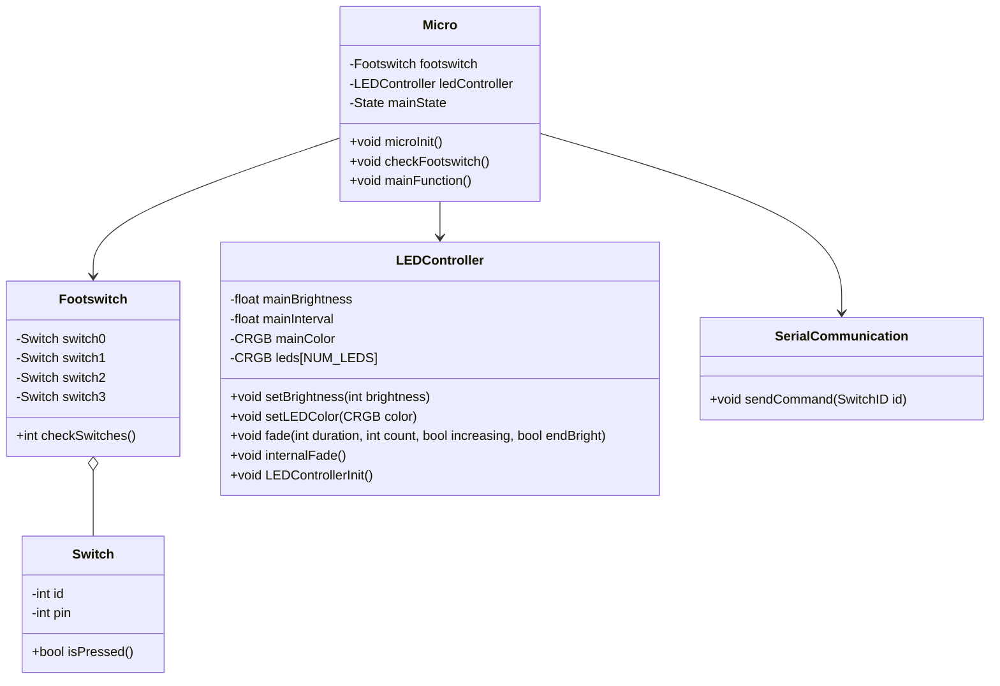

# Module design

```mermaid
classDiagram
    Footswitch o-- Switch
    Micro --> Footswitch
    Micro --> LEDController
    Micro --> SerialCommunication
    class Switch{
        -int id
        -int pin
        +bool isPressed()
    }
    class Footswitch{
        -Switch switch0
        -Switch switch1
        -Switch switch2
        -Switch switch3
        +int checkSwitches()
    }
    class Micro{
        -Footswitch footswitch
        -LEDController ledController
        -State mainState
        +void microInit()
        +void checkFootswitch()
        +void mainFunction()
    }
    class LEDController{
        -float mainBrightness
        -float mainInterval
        -CRGB mainColor
        -CRGB leds[NUM_LEDS]
        +void setBrightness(int brightness)
        +void setLEDColor(CRGB color)
        +void fade(int duration, int count, bool increasing, bool endBright)
        +void internalFade()
        +void LEDControllerInit()
    }
    class SerialCommunication{
        +void sendCommand(SwitchID id)
    }
```