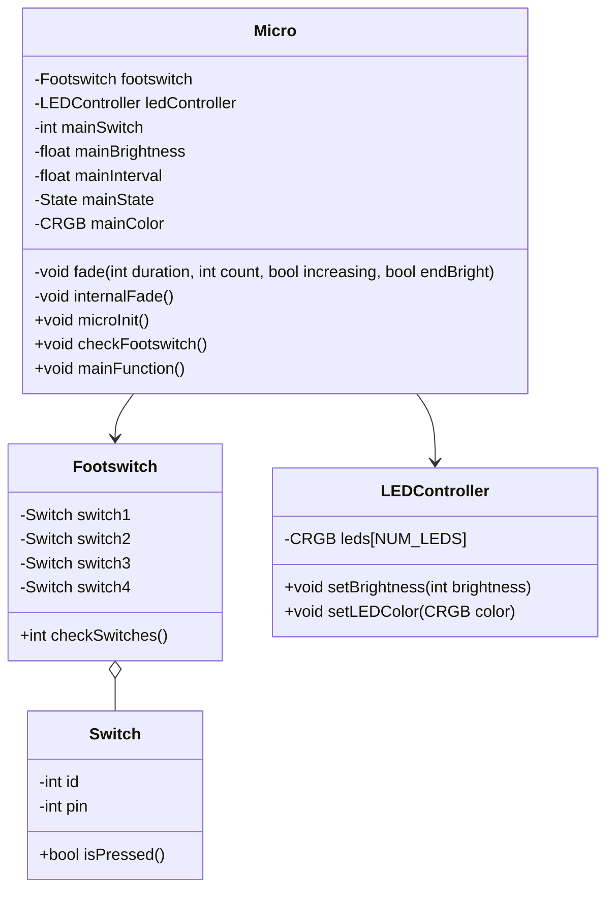

# Module design

```mermaid
classDiagram
    Footswitch o-- Switch
    Micro --> Footswitch
    Micro --> LEDController
    class Switch{
        -int id
        -int pin
        +bool isPressed()
    }
    class Footswitch{
        -Switch switch1
        -Switch switch2
        -Switch switch3
        -Switch switch4
        +int checkSwitches()
    }
    class Micro{
        -Footswitch footswitch
        -LEDController ledController
        -int mainSwitch
        -float mainBrightness
        -float mainInterval
        -State mainState
        -CRGB mainColor
        -void fade(int duration, int count, bool increasing, bool endBright)
        -void internalFade()
        +void microInit()
        +void checkFootswitch()
        +void mainFunction()
    }
    class LEDController{
        -CRGB leds[NUM_LEDS]
        +void setBrightness(int brightness)
        +void setLEDColor(CRGB color)
    }
```