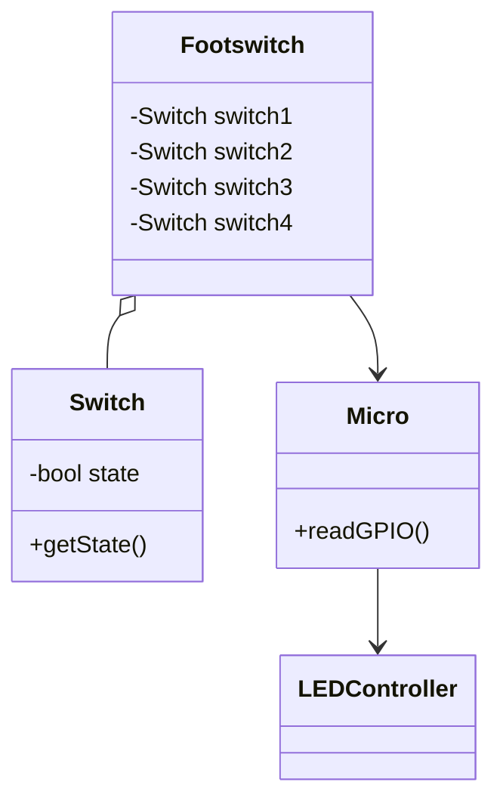

# Module design

```mermaid
classDiagram
    Footswitch o-- Switch
    Footswitch --> Micro
    Micro --> LEDController
    class Switch{
        -bool state
        +getState()
    }
    class Footswitch{
        -Switch switch1
        -Switch switch2
        -Switch switch3
        -Switch switch4
    }
    class Micro{
        +readGPIO()
    }
    class LEDController{

    }
```