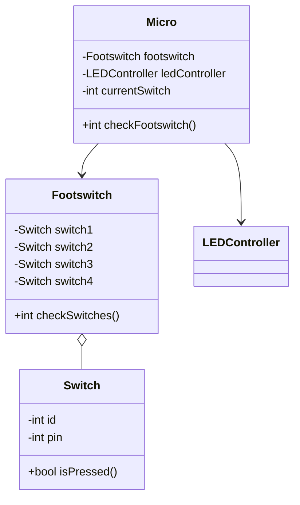

# Module design

```mermaid
classDiagram
    Footswitch o-- Switch
    Micro --> Footswitch
    Micro --> LEDController
    class Switch{
        -int id
        -int pin
        +bool isPressed()
    }
    class Footswitch{
        -Switch switch1
        -Switch switch2
        -Switch switch3
        -Switch switch4
        +int checkSwitches()
    }
    class Micro{
        -Footswitch footswitch
        -LEDController ledController
        -int currentSwitch
        +int checkFootswitch()
    }
    class LEDController{

    }
```