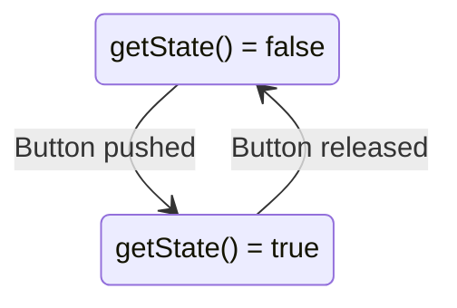

# Switch Class

## Class Description

The `Switch` class represents a physical pushbutton switch with unique identifier `id` and connection pin `pin`. The switch has two possible states: _pressed_ and _not pressed_. The default state is _not pressed_.

## Attributes

- `state`: A boolean attribute representing the state of the switch. `true` indicates the switch is _pressed_ and `false` indicates that it's _not pressed_.

## Methods

### `Switch(int idValue, int pinValue)`
- **Description**: This is the constructor for the `Switch` class. It initializes a new instance of a `Switch`, setting the id to `idValue` and the pin to `pinValue`.
- **Input Parameters**: 
    - `int idValue`: the unique identifier of the switch
    - `int pinValue`: the GPIO pin that the switch is connected to
- **Return Type**: Does not return a value.

### `~Switch()`
- **Description**: This is the destructor for the `Switch` class. It cleans up the instance of the `Switch` when it's no longer needed.
- **Input Parameters**: None.
- **Return Type**: Does not return a value.

### `bool getState()`
- **Description**: This method returns the current state of the `Switch`.
- **Input Parameters**: None.
- **Return Type**: Returns a boolean indicating the current state of the `Switch`. Returns `true` if the switch is pressed and `false` if it is not pressed. The default state is `false` (not pressed).

## Dependencies

This class does not have any dependencies on other classes.

## State diagram



## Examples

```
// create a new switch object with ID = 0 and GPIO pin = 8
Switch mySwitch(0, 8);

// check the state of the switch
bool currentState = mySwitch.getState();
if (currentState) {
  // code here runs if the switch is pressed
} else {
  // code here runs if the switch is not pressed
}
```