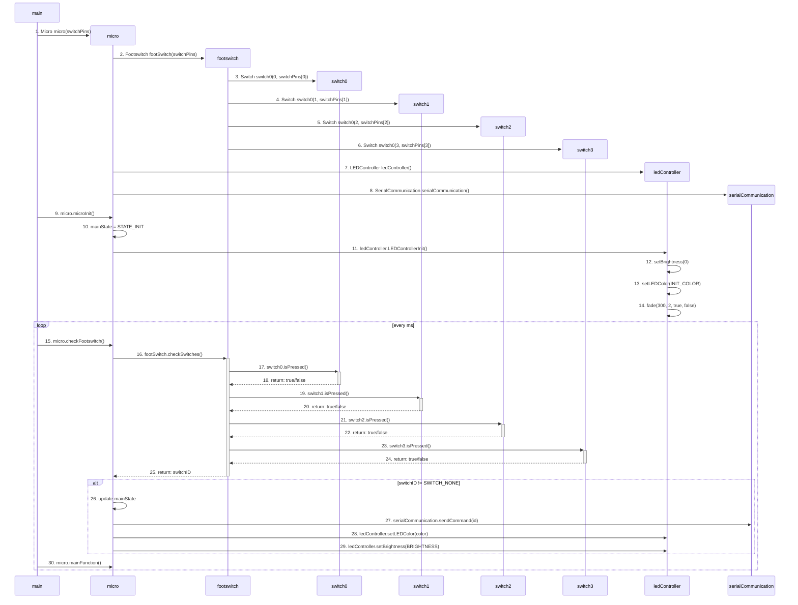

# Sequence diagram

```mermaid
sequenceDiagram
    
    create participant main

    create participant micro
    main->>micro: 1. Micro micro(switchPins)
    
    create participant footswitch
    micro->>footswitch: 2. Footswitch footSwitch(switchPins)
    
    create participant switch0
    footswitch->>switch0: 3. Switch switch0(0, switchPins[0])
    
    create participant switch1
    footswitch->>switch1: 4. Switch switch0(1, switchPins[1])
    
    create participant switch2
    footswitch->>switch2: 5. Switch switch0(2, switchPins[2])
    
    create participant switch3
    footswitch->>switch3: 6. Switch switch0(3, switchPins[3])
    
    create participant ledController
    micro->>ledController: 7. LEDController ledController()
    
    create participant serialCommunication
    micro->>serialCommunication: 8. SerialCommunication serialCommunication()
    
    main->>micro: 9. micro.microInit()

    micro->>micro: 10. mainState = STATE_INIT
    micro->>ledController: 11. ledController.LEDControllerInit()

    ledController->>ledController: 12. setBrightness(0);
    ledController->>ledController: 13. setLEDColor(INIT_COLOR);
    ledController->>ledController: 14. fade(300, 2, true, false);

    loop every ms
        main->>micro: 15. micro.checkFootswitch()
        micro->>+footswitch: 16. footSwitch.checkSwitches()
        footswitch->>+switch0: 17. switch0.isPressed()
        switch0-->>-footswitch: 18. return: true/false
        footswitch->>+switch1: 19. switch1.isPressed()
        switch1-->>-footswitch: 20. return: true/false
        footswitch->>+switch2: 21. switch2.isPressed()
        switch2-->>-footswitch: 22. return: true/false
        footswitch->>+switch3: 23. switch3.isPressed()
        switch3-->>-footswitch: 24. return: true/false
        footswitch-->>-micro: 25. return: switchID
        alt switchID != SWITCH_NONE
            micro->>micro: 26. update mainState
            micro->>serialCommunication: 27. serialCommunication.sendCommand(id)
            micro->>ledController: 28. ledController.setLEDColor(color)
            micro->>ledController: 29. ledController.setBrightness(BRIGHTNESS)
        end
        main->>micro: 30. micro.mainFunction()
    end
```