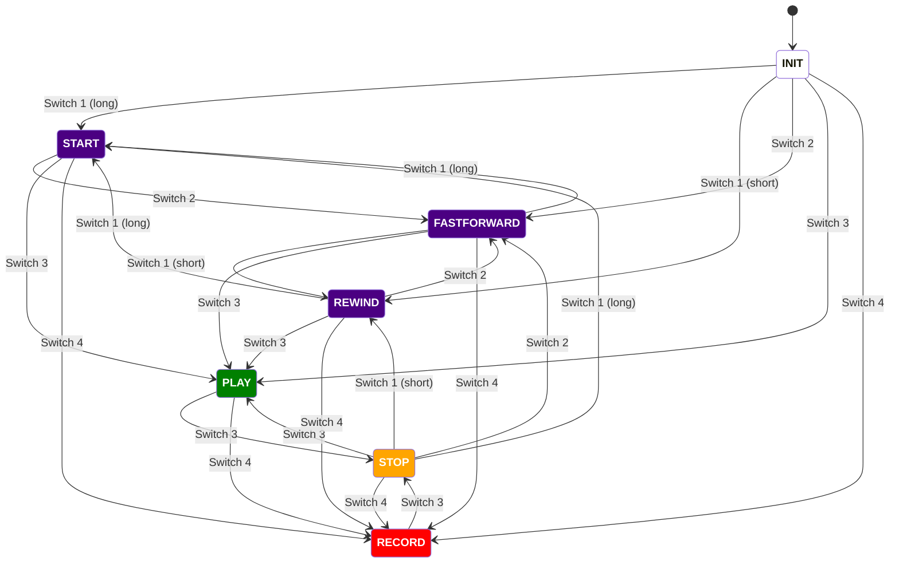

# State diagram

```mermaid
stateDiagram-v2
    classDef init fill:white,font-weight:bold
    classDef start fill:indigo,color:white,font-weight:bold
    classDef rewind fill:indigo,color:white,font-weight:bold
    classDef fastforward fill:indigo,color:white,font-weight:bold
    classDef play fill:green,color:white,font-weight:bold
    classDef stop fill:orange,color:white,font-weight:bold
    classDef record fill:red,color:white,font-weight:bold

    [*] --> INIT
    STOP --> START : Switch 1 (long)
    STOP --> REWIND : Switch 1 (short)
    STOP --> FASTFORWARD : Switch 2
    STOP --> PLAY : Switch 3
    STOP --> RECORD : Switch 4

    PLAY --> STOP : Switch 3
    PLAY --> RECORD : Switch 4

    RECORD --> STOP: Switch 3

    START --> FASTFORWARD : Switch 2
    START --> PLAY : Switch 3
    START --> RECORD : Switch 4

    INIT --> START : Switch 1 (long)
    INIT --> REWIND : Switch 1 (short)
    INIT --> FASTFORWARD : Switch 2
    INIT --> PLAY : Switch 3
    INIT --> RECORD : Switch 4
    
    REWIND --> START : Switch 1 (long)
    REWIND --> FASTFORWARD : Switch 2
    REWIND --> PLAY : Switch 3
    REWIND --> RECORD : Switch 4

    FASTFORWARD --> REWIND : Switch 1 (short)
    FASTFORWARD --> START : Switch 1 (long)
    FASTFORWARD --> PLAY : Switch 3
    FASTFORWARD --> RECORD : Switch 4

    class INIT init
    class START start
    class REWIND rewind
    class FASTFORWARD fastforward
    class PLAY play
    class STOP stop
    class RECORD record
```