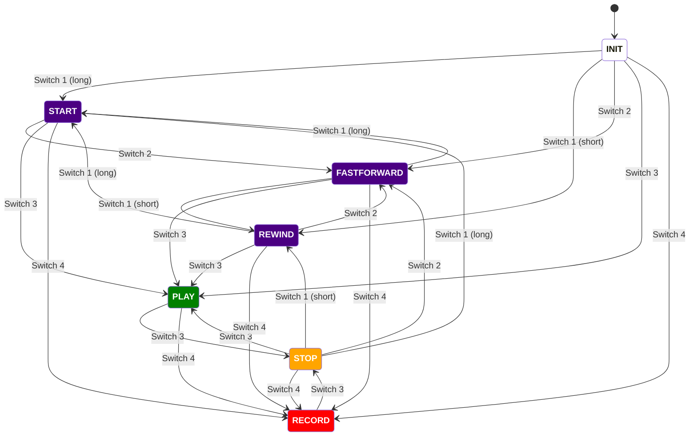

# State diagram

This document details the state machine implemented in this project, first with a description of each of the states, then with a state diagram. 

Note the distinction between the **INIT** initialization state and the **START** state. From an embedded software perspective, these may sound similar. However, from a musician's perspective, **INIT** is simply the default start-up condition of the transport controller, whereas **START** is a return to the start / beginning of the track.

## State descriptions

**INIT:** this is the initialization state. On power-on reset, the microcontroller is in the INIT state.
<strong style="color:purple">START:</strong>  this state entails a return to the beginning of the track.
<strong style="color:purple">REWIND:</strong> this is the resulting state after stepping back in the track by one bar.
<strong style="color:purple">FASTFORWARD:</strong> this is the resulting state after stepping forward in the track by one bar.
<strong style="color:green">PLAY:</strong> the track is actively playing.
<strong style="color:orange">STOP:</strong> the track is stopped.
<strong style="color:red">RECORD:</strong> the track is recording.

## Diagram

