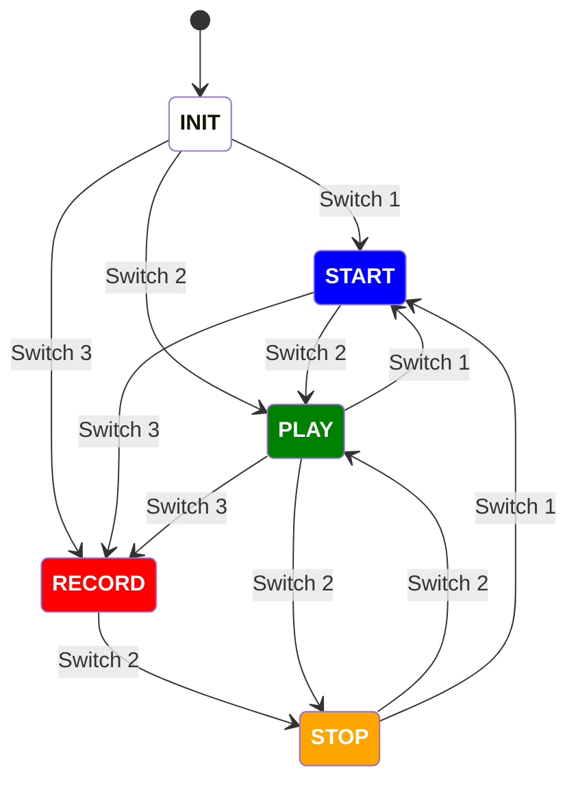

# State diagram

```mermaid
stateDiagram-v2
    classDef init fill:white,font-weight:bold
    classDef start fill:blue,color:white,font-weight:bold
    classDef play fill:green,color:white,font-weight:bold
    classDef stop fill:orange,color:white,font-weight:bold
    classDef record fill:red,color:white,font-weight:bold

    [*] --> INIT
    INIT --> START : Switch 1
    INIT --> PLAY : Switch 2
    INIT --> RECORD : Switch 3
    
    RECORD --> STOP: Switch 2

    START --> PLAY : Switch 2
    START --> RECORD : Switch 3

    PLAY --> STOP : Switch 2
    PLAY --> RECORD : Switch 3
    PLAY --> START : Switch 1

    STOP --> PLAY : Switch 2
    STOP --> START : Switch 1

    class INIT init
    class START start
    class PLAY play
    class STOP stop
    class RECORD record
```